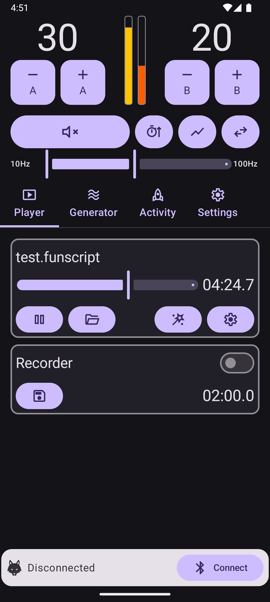
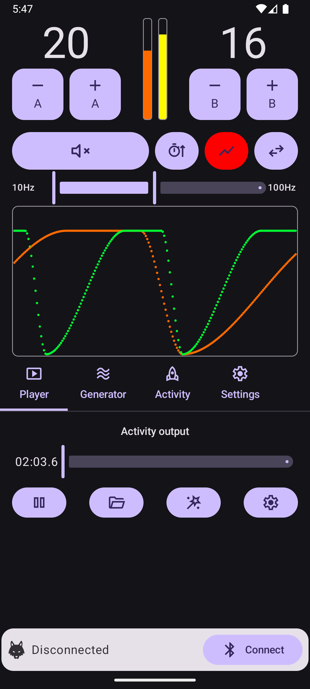
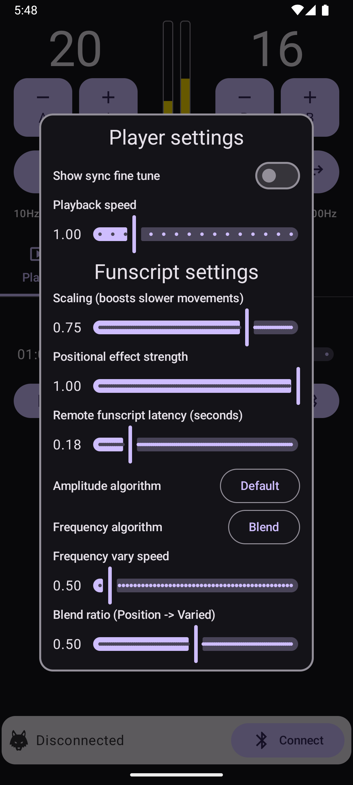
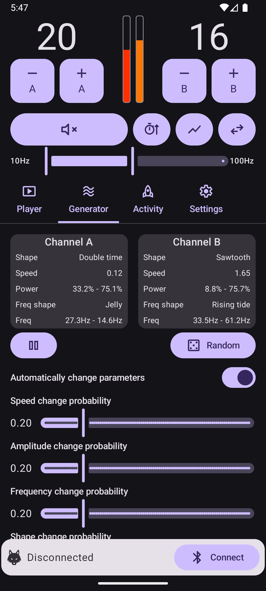
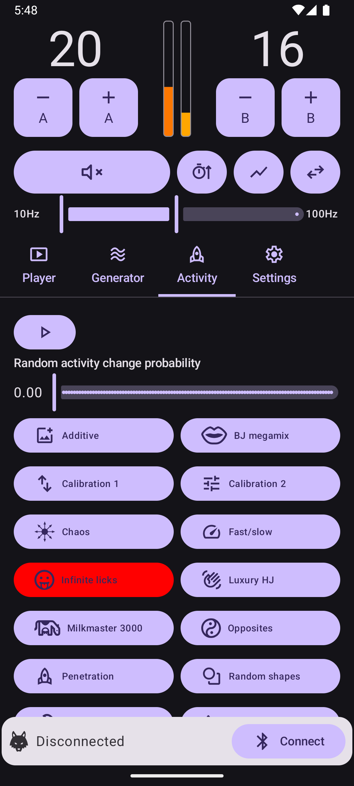
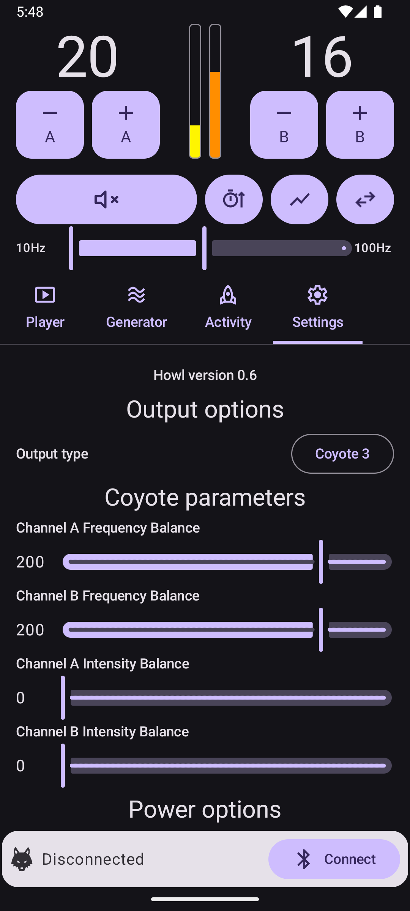
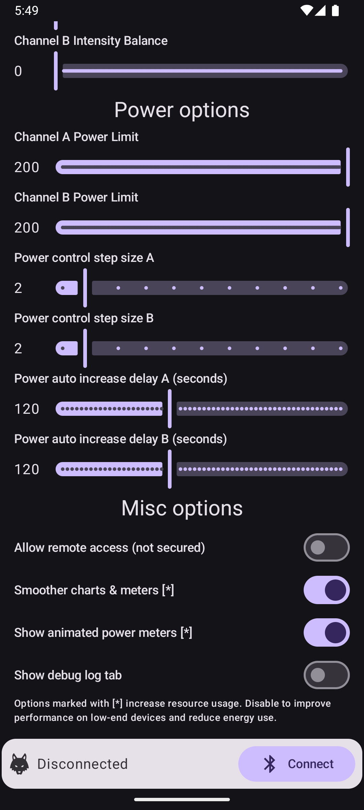

# Howl

> [!CAUTION]
> **IMPORTANT DISCLAIMER** Howl is a free hobbyist app that carries no warranty, and we accept no liability. Any use of the app and any use of electronic stimulation ("estim") devices is at your own risk.

## Description

Howl is an Android app that controls and generates patterns for estim devices, for erotic adult entertainment.

Current features are: -
* Playback of funscript files (normally for "stroker" type toys), using an original algorithm.
* Playback of HWL files, which are preconverted audio files specifically for use with Howl.
* Several built-in "activities" to enjoy. These are patterns with random elements that Howl generates in real-time.
* A wave generator with various different parameters and shapes.
* Convenient automatic synchronisation of funscript files with videos, via our "Howl Sync" add-on for Kodi.

## Installation

A pre-built APK file for the latest version can be <a href="https://github.com/Amethyst-Sysadmin/Howl/releases/latest/download/howl.apk">found here</a>. You simply need to install the APK file on your Android device.

Additional downloads, including older versions and the Kodi add-on, may be found on the main <a href="https://github.com/Amethyst-Sysadmin/Howl/releases">Releases page</a>.

## Device support

The output devices currently supported by Howl are: -
* DG Lab Coyote 3. This is the device Howl was originally developed for, and generally works well.
* DG Lab Coyote 2. The main downside of the older Coyote 2 is that it is only capable of updating 10 times per second, as opposed to 40 on the C3. Some of Howl's faster patterns might change too quickly to be well represented (if needed you can use the "playback speed" global setting to slow anything down).
* Any device that has audio input (more experimental, see [notes in wiki](https://github.com/Amethyst-Sysadmin/Howl/wiki/Audio-output))

The Howl app is intended to run on any version of Android from 8.0 (released in 2017) onwards. However testing with very early versions has been limited.

## App screenshots

Here are some screenshots of different parts of the application.

<table>
  <tr>
    <td>Player</td>
    <td>Player with chart</td>
    <td>Player settings</td>
  </tr>
  <tr>
    <td></td>
    <td></td>
    <td></td>
  </tr>
</table>

<table>
  <tr>
    <td>Generator</td>
    <td>Activity</td>
  </tr>
  <tr>
    <td></td>
    <td></td>
  </tr>
</table>

<table>
  <tr>
    <td>Settings (1)</td>
    <td>Settings (2)</td>
  </tr>
  <tr>
    <td></td>
    <td></td>
  </tr>
</table>

## Electrode setup and balance

We suggest setting up your electrodes such that channel "A" produces a sensation you feel lower down, and channel "B" produces a sensation that you feel higher up. This is especially important for funscripts and some of the built-in activities which use positional effects.

Exactly what electrodes to use and where to place them is personal preference. Most common is to have two separate poles on each channel, which usually means two electrodes (e.g. two TENS pads or two conductive rubber loops on a channel), but some toys will be connected as both poles on their own. You can also use a configuration with three poles in total, with both channels sharing one common electrode in the middle (and having an additional dedicated one each).

Either type of setup can work well with Howl, it's just a matter of finding what electrodes and placements feel best to you. The only important thing is that activity on channel "A" gives you a lower sensation, and activity on channel "B" gives you a higher sensation. For example when playing back a funscript we will send a stronger signal on A if the stroker device we're simulating would be at the bottom, or a stronger signal on B if the stroker would be at the top.

Always follow best practice and your device manufacturer's instructions, and do not under any circumstances connect any electrode above your waist.

We've provided some calibration patterns (found on the "Activity" tab) to help you choose optimal settings to get the best effect with your chosen electrode configuration.

### Calibration 1 - positional effects

To optimally experience positional effects, it helps if the power levels to each channel are well balanced, with signals to A and B feeling equally strong.

Calibration 1 is a pattern that moves from channel A to channel B and back, repeating every 4 seconds. Just a single frequency (the middle of the configured range) is used. The goal is to adjust your main power levels for channel A and B so that each end (when the signal is fully on A or fully on B) feels equally strong to you.

Once you've done this adjustment, you should hopefully find that you can feel the illusion of sensation travelling through the middle (where you don't directly have electrodes) as it moves back and forth. This is the intended positional effect.

It's not an exact science as you'll probably want to adjust power levels over the course of a session. But the calibration should at least give you rough guide to think "Ah, I always need to set the channel A power higher to get a good balance with these electrodes" (or whatever you discovered, depending on your setup).

### Calibration 2 - frequency balance

Calibration 2 is a pattern that sweeps through all of the configured frequency range. It's designed to help you optimally set the frequency balance parameters (which are a feature of the Coyote hardware) so that high and low frequencies feel equally strong.

The pattern changes channels periodically, as follows: -
* Channel A only (16 seconds)
* Channel B only (16 seconds)
* Both channels simultaneously (16 seconds)
* Then back to channel A only, with the same pattern repeating forever.

Your goal is to make the lowest (most thumpy) frequency and the highest (most buzzy) frequency on each channel feel equally strong to you. This can be a little tricky as they are different types of sensations, but this is all about your perception, so just give it your best shot.

You adjust this by changing "Channel A Frequency Balance" (or the equivalent for channel B), which is found on the "Settings" page.
* If the low frequencies are too weak and the highs feel stronger, increase the frequency balance.
* If the low frequencies are too strong and the highs feel weaker, reduce the frequency balance.

Take a note of the optimal frequency balance numbers that you discovered for your electrode configuration. As this is a Coyote feature, you can also reuse it in other places (e.g. the DG Labs app supports the same frequency balance setting).

Having a nice balance between the high and low frequencies helps give you a good experience across the whole frequency range. It also helps to limit "surprises" where a pattern might change frequency and suddenly feel much stronger.

## Main controls

Howl's main controls are displayed in the top section of the screen.

### Channel A/B power controls

The plus and minus buttons adjust the overall power on their corresponding channel up and down. This directly corresponds to the power level on the Coyote, and has a maximum range of 0 to 200. The maximum level you can turn the power up to is also governed by the power limit configured on the settings page.

The step size for the power controls defaults to 1, but this can be increased on the settings page if you would like larger steps. A long press on the minus control allows power on the corresponding channel to be quickly set to zero.

### Mute pulse output button

This button mutes all pulse output to the Coyote when activated, until it is pressed again. Files keep playing during this time, but no output is sent. This control is very handy if you want to briefly mute in order to adjust your electrodes. The fact that playback continues allows funscripts to remain in sync.

### Automatic power increase button

When toggled on, the power level will automatically be increased periodically. The delay is configurable on the "Settings" page, and can optionally be different for each channel.

To help with safety and predictability, the auto increase will only happen when the following conditions are met: -

* The automatic increase toggle button is on.
* Something is actively being played.
* The mute output control is off.
* Power on the channel is higher than zero (you must manually set the power level to at least 1 before the automatic increases will begin).

The power level increases by 1 each time the configured delay elapses, it does not use the configured power step size. This is by design and allows for the smoothest possible increase over time.

### Pulse chart toggle button

The chart toggle button (looks like a section of line graph) can show a basic pulse chart to give a visual display of what output Howl is generating. This is extremely useful for development and debugging, or just general interest. The chart cannot be used to diagnose performance issues as it only shows what we generated, not when or if the pulse was actually sent.

The button toggles between 3 chart modes: -

**Off (default)**
No chart is displayed, and there is no performance overhead.

**Combined**
A single chart is displayed, with time on the X axis (most recent on the right) and power on the Y axis. The top of the chart corresponds to maximum output power, and the bottom of the chart to zero power. The colour of each point denotes the channel and gives a rough guide to the frequency. Channel A points go between red (lowest frequency) and yellow (highest frequency). Channel B points go between blue (lowest frequency) and green (highest frequency).

**Split**
Two separate charts are displayed. For both charts the X axis is time (most recent on the right), red points are on channel A, and blue points are on channel B. The chart on the left shows power (maximum at the top and minimum at the bottom). The chart on the right shows frequency (maximum at the top and minimum at the bottom). The split chart can be harder to understand, but is useful if you need a more accurate display of what the frequency is doing.

Each point represents a set of values we've calculated to send to the Coyote, so points occur on each channel every 1/40th of a second to correspond to its maximum update rate. The last 200 pulses we've calculated (5 seconds of data) are shown by the charts.

### Channel swap button

The channel swap button (with two opposing arrows) swaps the output on channel A and channel B when active. This is helpful if you connected your electrodes the wrong way round, or if you are playing an HWL file where the original audio had different electrode placement to Howl's preferred setup.

It does not swap the power controls, only what is output (i.e. channel A power always controls Coyote channel A regardless of this setting).

### Frequency range slider

This slider sets the minimum and maximum frequency that Howl can use during playback. The full range of frequencies between these values may be used for output. Everything Howl plays is mapped in real-time to the range you've set. Don't forget that you can always adjust this control to your liking, whatever content happens to be playing.

Not every feature uses the entire frequency range you've set, but everything uses at least a subset of your configured range, so adjusting it will always do something.

## Player

The "Player" tab allows you to play back different kinds of files. Currently it supports funscripts and HWL files. Your files need to be stored somewhere on your device that doesn't require any special permissions to access (I just put mine in a subfolder inside "Documents").

See the [funscript wiki page](https://github.com/Amethyst-Sysadmin/Howl/wiki/Funscripts) for more details about funscripts and using them with Howl.

### Player advanced options

This section explains the function of all the player options.

#### Player settings

Global settings for the player that affect all app output (features like the generator and activities also send their output via the player).

**Show sync fine tune**
When enabled, a control will appear below the player allowing slight adjustments to Howl's playback position (up to +/- 0.5 seconds). This can be helpful if the content you're trying to play is supposed to sync up with something else (for example a video) and makes it easier to obtain perfect sync. The sync adjustment is a temporary control and will reset to zero upon opening a new file. For correcting typical funscript latency when using the Kodi add-on, use the "Remote funscript latency" setting instead.

**Playback speed**
This controls the rate at which the player counts time, allowing any content Howl can play to be sped up or slowed down. The playback speed can be set from 0.25x to 4.0x, in increments of 0.25. For example setting this control to 0.5 will play at half speed. Setting it to 2.0 will play at double speed. 1.0 is the most typical setting and plays at normal rate.

The player settings section also contains the advanced settings for funscripts, which are explained on the [funscript wiki page](https://github.com/Amethyst-Sysadmin/Howl/wiki/Funscripts).

### Special effects
The player can optionally apply various interesting special effects, which are accessed via the "magic wand" button. These work with all types of content, and can sometimes very significantly change the output.

**Apply special effects**
When toggled on, any configured special effects are applied. When toggled off, all controls in the "Special effects" section are ignored and have no effect on output.

**Invert channel A/B frequencies**
This inverts all the frequencies played on that channel. So if it would have played the lowest frequency, it will instead play the highest frequency (and vice versa). Setting one or both of these when playing a converted audio file can be interesting, and sometimes gives a very different experience.

**Scale amplitude (channel A/B)**
This allows the amplitude of all output on a channel to be scaled down or up. For example setting scale amplitude to 0.5 will halve the power of the file or pattern so that it does not go beyond 50%. The main purpose of this setting is to assist some Coyote 3 users who found that the output was too strong with certain very conductive electrodes, even with the output power set to the minimum of 1.

**Frequency feel adjustment**
This changes the way in which the configured frequency range is used, which allows some control over the general feeling of the output. The default value is 1.0. Values lower than 1 result in more use of lower frequencies, which can feel more "thumpy" and "physical". Values higher than 1 result in more use of higher frequencies, which can feel more "buzzy" and "electrical". It's probably easiest to think of the control as shifting where the middle of the frequency range is (but everything is rescaled around this so the full range is still used).

Lower values like 0.5 or 0.75 can work quite well with funscripts if you'd like a more physical overall sensation.

**Random amplitude noise (amount/speed)**
Introduces an element of random noise into the power values we would output. The easiest way to understand it is to play the "Calibration 1" activity and look at the output chart - you will see it's a nice smooth repeating curve. Now set this control to 0.1, and observe the difference. You'll see that the output follows approximately the same shape, but it's now jagged and bouncy instead of smooth, which will feel different.

There's also a control for the speed of our generated noise. Higher values will cause the output to bounce around more rapidly, and lower values will cause it to bounce around more slowly.

**Random frequency noise (amount/speed)**
The same concept as the random amplitude noise control, but affects frequency instead. This can be very useful with something like a converted audio file that just sits on one frequency (which is pretty common). By applying some random frequency noise at a slow speed, you can make the frequency shift around in a pleasing way instead.

## Generator

The "Generator" feature is capable of playing back continuous waves with a number of different shapes and a wide range of parameters. These are generated mathematically, so should usually be as close to perfect waves as it's possible to represent on the Coyote.

The shapes, speeds and frequencies of the waves can all vary, so a vast number of different combinations is possible. You'll probably find some that are highly pleasurable, and some that aren't great. Every time you press the "Random" button, you'll get a different wave with a new set of parameters. Keep trying your luck, and you're almost guaranteed to find something you enjoy.

You can tap on the "Channel A" or "Channel B" parameter box if you'd like to manually configure the wave parameters yourself.

There's an "Automatically change parameters" option which is designed to be a provide a more continuous experience by changing the wave parameters over time. The concept is that it's a bit like somebody else playing around with the knobs and buttons on a control box for you. It's capable of adjusting parameters like speed, power and frequency smoothly over time at different rates. So the experience should evolve over time, in contrast to the random button which just immediately rerolls everything.

The probability of speed, power, frequency and shape changes can all be set independently when using the automatic mode. The maximum value of 1.0 here corresponds to an average of 10 changes per minute. So 0.1 would be 1 change per minute on average etc. But keep in mind these are just probabilities rather than guarantees, depending on chance you may see significantly more or less changes than the average.

## Activity

Howl offers a number of built-in "activities". These are small programs, usually with some random elements. They're intended to offer a more interesting alternative to having fixed preset patterns, or just playing back a file.

The activities are generally designed with the default 10Hz-100Hz frequency range in mind (but you can certainly change it and experiment). They do not necessarily use the full configured range, as each activity is intended to feel unique and noticeably different from the others.

A short description of the currently available activities is given below. Please keep in mind that nothing is gender restricted, regardless of how it's described. One of the great things about estim is that it's all just electrons, and your perception of patterns could be different from mine.

### Additive
Inspired by the audio technique of additive synthesis, this activity takes two simple underlying waves and combines them in different proportions to generate the output amplitudes. Frequencies are generated in a similar way, by combining another two waves in different proportions. We periodically change the speeds and shapes of the underlying waves, as well as the proportions used to combine them. The end result produces some very complicated and interesting patterns, which will keep changing over time as we modify parameters.

### BJ megamix
An ambitious activity that moves randomly between four distinct stages, intended to represent aspects of a blowjob. The stages are suck, deepthroat, tip licks, and full length (base to tip) licks. The licking stages are typically shorter and are intended to break up the main patterns and make the flow of the activity more interesting. Can you feel the differences between all four patterns?

### Chaos
Generates completely random frequencies and amplitudes on both channels, the Coyote equivalent of "white noise". To add a bit of additional interest, how long each value is held for changes periodically and can be anywhere from 1-10 cycles (0.025 seconds to 0.25 seconds).

### Fast/slow
One channel has a very fast sawtooth wave, and the other has a very slow sawtooth wave. One starts at the maximum frequency, and one starts at the minimum frequency. Over the course of an iteration of the pattern, the slow wave speeds up, the fast wave slows down, the minimum frequency wave inreases in frequency, and the maximum frequency wave reduces in frequency. Until the waves on each channel have essentially swapped, and then the pattern repeats. To make things a bit more interesting the sawtooth waves can go in either direction and can be linear or hermite interpolated. Sometimes aspects of the pattern will swap instantaneously at the end of an iteration.

### Infinite licks
A phantom tongue (or is it multiple tongues?) repeatedly licks you at varying positions and speeds, with little regard for the laws of physics. It's a complicated pattern with instantaneous jumps and a high level of speed and amplitude variance. This is generally one for high frequency enjoyers, as only the top half of the configured frequency range is used.

### Luxury HJ
Inspired by some good old fashioned stroking, there's lots of smooth top to bottom activity using our positional algorithm. The speed shifts around smoothly and fairly often. "What makes it luxury?" you may ask. From time to time a different "bonus" pattern can appear on either channel which is supposed to feel like flickering touches around those electrodes directly. That might be a sweeping palm, or a probing finger. Depends on your imagination and where you put your electrodes I guess. Ooh la la!

### Milkmaster 3000
A merciless milking machine from the year 3000. This one can be pretty intense. Moo.

There are two very distinct stages. First the "WOMP" stage where strokes (which are randomly either top to bottom or bottom to top) continually increase in speed. So I think of it as going WOMP.... WOMP.... (getting faster and faster) WOMPWOMPWOMPWOMPWOMP! Then comes the BUZZ stage which continuously plays a low frequency on channel A and a high frequency on channel B (the exact frequencies vary randomly a bit and change over the buzz duration a bit). Then repeat.

### Opposites
Channel A's frequency and power both each shift around the whole range in fairly smooth curves at varying speeds. Channel B always does the exact opposite. So if A is at full power, B is at zero power. If A is at the highest frequency, B is at the lowest frequency. It's a simple idea, but I liked the result.

### Overflowing
This is probably more of a "finisher" pattern. Channel B sits at high power the majority of the time (fluctuating slightly in a smooth lapping effect). Channel A cycles repeatedly from low to high power in smooth waves. High frequencies are always used on both channels (60-100% of the range) and vary over time. Use the channel swap button with the player controls to try it the other way round with channel A holding high power.

### Penetration
Inspired by: just sex innit mate. The channel B part of the wave is quite unusually shaped and is designed to peak at different points to the A wave, helping to represent the in/out movements. Lots of smooth speed changes over time. There are also some more subtle random changes to "feel" and how the frequency range is used over time. Uses plenty of artistic licence and needs a healthy dose of imagination (as with most of these).

### Random shapes
Generates waves where the amplitude has a random shape. They always start and end at zero, but the middle section of each wave has between 2 and 5 completely random points, which we then interpolate between to form a smooth shape. Periodically we switch to a new iteration of the pattern and generate new random shapes. The frequency on each channel is fixed per iteration, but will change each time we change the shapes.

### Relentless
Generates patterns that are always based around a classic repeating wave shape at moderate speeds (which is why it's relentless). The wave shapes actually have a lot of subtle randomness and can have different attack and decay characteristics, and sometimes a hold of varying length at the top. The output channels always share the same basic shape, but one channel will repeat it at exactly 1, 2, 3 or 4 times the speed of the other channel. The frequency on each channel is fixed per iteration, but will change periodically (as will the wave shapes).

### Simplex
An activity based on simplex noise, which is a computer graphics technique that could be used to generate a random landscape in a game (for example). We use it here to generate a seemingly endless pattern of unpredictable rolling peaks and troughs. This version produces a classic simplex noise pattern, with a chart that looks very much like a landscape. Parameters such as the traversal speed  will vary smoothly over time. Because this classic simplex generation completely lacks any repetition, you might not find it as pleasurable as the other options.

Frequency generation works in a similar way, but traverses the pattern at a fixed slow speed. The frequencies will shift around their range slowly in a fairly pleasing and natural way (all three of the simplex patterns actually use exactly the same frequency generation).

### Simplex Pro
An enhanced simplex pattern that introduces a repetitive element, while still being able to vary endlessly. Our classic simplex pattern took the A and B channel amplitudes from either side of a circle centred at our position in the landscape. So they often move in a connected way (as the points are close to each other) but aren't exactly the same. I thought "Hmm, what if we also spin the circle round?" and the unholy abomination that is our simplex pro pattern was born.

Because we move forward at a slower rate, and our circle is spinning, we usually pass close to the same points on the landscape several times. This introduces some very nice repetition which the standard simplex pattern lacked, and very often results in "pumping" patterns that go back and forth between our two channels.

Simplex pro is the most varied of our simplex noise based patterns, and the level of repetition will vary significantly as our traversal speed and rotation speed smoothly shift around their ranges.

### Simplex Turbo
Essentially the same pattern as simplex pro, but the rotation speed only goes between very fast and absolutely ridiculous. Probably not suitable for humans! ;)

### Sliding vibrator
Designed to feel like a vibrator being slowly and teasingly moved over... well whatever you put your electrodes on! Power is based on our positional algorithm and varies as the vibrator slowly moves around. Movement is smooth and at varying (but generally slow) speeds. Sometimes it will stop and hold position for a few seconds. The frequency sits on a fixed value for a while and only changes from time to time (representing the vibrator being switched to a different speed).

## Settings

### Output type

Selects what kind of output device Howl is using. When connecting a Bluetooth device the appropriate output type will be selected automatically.

Supported output types are: -
* Coyote 3
* Audio (continuous) - continuous output for audio devices, [see wiki](https://github.com/Amethyst-Sysadmin/Howl/wiki/Audio-output) for details.
* Audio (wavelet) - wavelet output for audio devices, [see wiki](https://github.com/Amethyst-Sysadmin/Howl/wiki/Audio-output) for details.

### Coyote parameters

These are all the parameters that can be set on the Coyote itself. Functionality should be exactly the same as the equivalent settings in the DG Labs app.

**Channel A/B Frequency Balance**
This controls the relative strength of high and low frequencies on that channel. Higher values give stronger low frequencies. Our default is 200 (refer to the "Calibration 2" section above to optimise for your own electrode setup).

**Channel A/B Intensity Balance**
This seems to be another way to adjust the low frequencies on the relevant channel. I haven't found it very useful and tend to leave it at 0. It seems to mainly affect the very lowest supported frequencies, e.g. instead of playing at 1Hz it will actually send 10Hz if you increase the intensity balance a bit. I don't think it's particularly helpful for this app, since if you don't want the very lowest frequencies, you can just adjust the main frequency range control.

### Power options

**Channel A/B Power Limit**
Limits output device power on that channel to the selected level. The maximum output power level is 200.

**Power control step size**
This sets how much the power level changes by when you press the large plus/minus buttons in Howl to change the channel A or B power. The default is 1. This is a convenience setting for users who like to use high power levels, allowing them to be reached without having to press the adjustment buttons as many times. The step size can be independently configured for each channel, which can be helpful when using different types of electrode.

**Power auto increase delay**
This sets the delay in seconds which should elapse each time we automatically increase the power. It only has an effect when the automatic power increase button on the main control panel is toggled on. See the section on the automatic power increase button for further caveats around when the automatic increase happens.

The delay can be configured independently for each channel, which can be helpful when using different types of electrode.

### Misc options

**Allow remote access (not secured)**
This setting enables remote access to Howl so that it can be controlled by other apps (such as the Howl Sync Kodi add-on). It says "not secured" as a reminder that there are no access passwords or keys required - Howl will accept requests from anything that connects to the port. It's expected that you will be using this feature on a typical home network that sits behind a NAT router. You should not forward ports or allow access from the internet.

**Smoother charts & meters**
This setting causes our charts and meters to update with every pulse (40 times per second) instead of every batch (10 times per second). This looks nicer, but uses additional resources and energy. The difference is only visual, pulse output remains smooth with either setting.

**Show animated power meters**
This setting causes animated power meters to be shown for each channel on the main control panel. Disabling it removes the meters, reducing resource usage.

**Show debug log tab**
When this setting is enabled, a "Debug" tab becomes visible, located to the right of "Settings" on the main tab bar (on narrower devices you may need to scroll the bar to see it). The debug tab shows information from Howl's internal log, which may sometimes be useful for troubleshooting issues.

## Kodi add-on

The Howl Sync add-on for Kodi allows .funscript files for videos that you're playing in Kodi to be automatically sent to Howl and synchronised with the video position. It is by far the most convenient method for playing funscripts. [See the wiki](https://github.com/Amethyst-Sysadmin/Howl/wiki/Kodi-add%E2%80%90on) for installation and setup details.

## Common questions and answers

**Can I use Howl on iOS?**
No. Howl is a native Android app, so it's unlikely that an iOS version will ever exist (that would require rewriting most of the app).

## Privacy

Howl is a simple hobbyist app, and does not include any adverts or tracking. It does not send anything over the internet, and doesn't require internet access.

On Android versions before 12, the app will ask for location permissions. Howl does not track your location at all, and this is simply because the location permission is required to scan for Bluetooth devices on those versions. On later versions of Android, the app only requires Bluetooth permissions.

## License

All original code is released under the MIT License. There is an additional stipulation that if you distribute this app or any part of it (with or without changes), you may not use the name Howl, or any very similar name. This is to help make it clear to users that your distribution is not associated with this project.