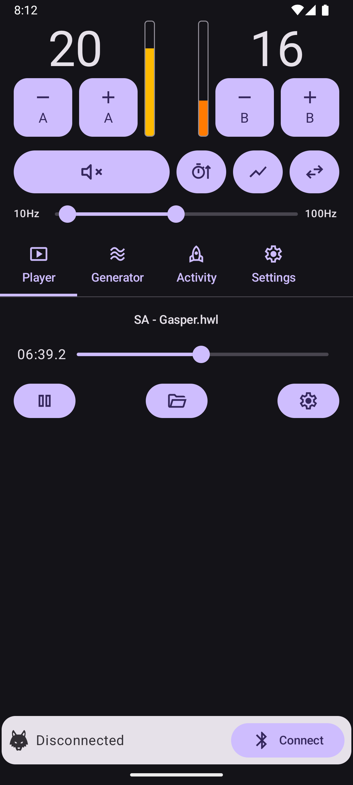
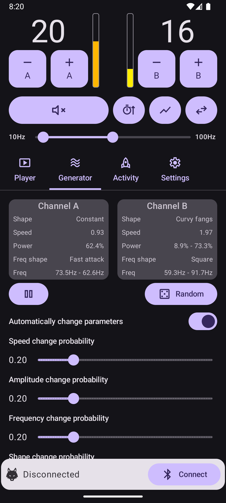
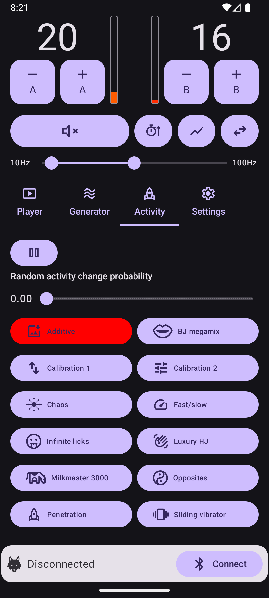

# Howl

> [!CAUTION]
> **IMPORTANT DISCLAIMER** Howl is a free hobbyist app that carries no warranty, and we accept no liability. Any use of the app and any use of electronic stimulation ("estim") devices is at your own risk.

## Description

Howl is an Android app that controls and generates patterns for estim devices, for erotic adult entertainment.

Its features include: -
* Playback of funscript files, using an original positional algorithm.
* Playback of HWL files, Howl's native format, often used for preconverted audio files.
* Built-in "activities". These are patterns with random elements that Howl generates in real-time.
* A wave generator with various different parameters and shapes.
* Automatic synchronisation of funscript files with videos, using our "Howl Sync" add-on for Kodi.
* Ability to record anything that Howl can play to an HWL file, enabling the easy creation of custom patterns.

## Installation

A pre-built APK file for the latest version can be <a href="https://github.com/Amethyst-Sysadmin/Howl/releases/latest/download/howl.apk">found here</a>. You simply need to install the APK file on your Android device.

Additional downloads, including older versions and the Kodi add-on, may be found on the main <a href="https://github.com/Amethyst-Sysadmin/Howl/releases">Releases page</a>.

## Supported devices

The output devices currently supported by Howl are: -
* DG Lab Coyote 3. This is the device Howl was originally developed for, and generally works well.
* DG Lab Coyote 2. The main downside of the older Coyote 2 is that it is only capable of updating 10 times per second, as opposed to 40 on the C3. Some of Howl's faster patterns might change too quickly to be well represented (if needed you can use the "playback speed" global setting to slow anything down).
* Almost any device that accepts audio input (more experimental, see [notes in wiki](https://github.com/Amethyst-Sysadmin/Howl/wiki/Audio-output))

The Howl app is intended to run on any version of Android from 8.0 (released in 2017) onwards. However testing with very early versions has been limited.

## App screenshots

<table>
  <tr>
    <td>Player</td>
    <td>Generator</td>
    <td>Activity</td>
  </tr>
  <tr>
    <td></td>
    <td></td>
    <td></td>
  </tr>
</table>

## Electrode setup

Howl expects you to set up your electrodes such that channel A creates a "lower down" sensation, and channel B creates a "higher up" one. This is especially important when playing funscripts, as our algorithm will distribute power according to the positions in the funscript, so that you feel sensations in the right place.

Always follow best practice and your device manufacturer's instructions, and do not under any circumstances connect any electrode above your waist.

[The wiki](https://github.com/Amethyst-Sysadmin/Howl/wiki/Electrode-setup-and-calibration) provides further details, including information on calibrating frequencies optimally for your setup for Coyote 3 owners.

## Main controls

Howl's main controls are displayed in the top section of the screen.

### Channel A/B power controls

The plus and minus buttons adjust the overall power on their corresponding channel up and down. The full range is 0 to 200. The maximum level you can turn the power up to is also governed by the power limit configured on the settings page (70 by default).

The step size for the power controls defaults to 1, but this can be increased on the settings page if you would like larger steps. A long press on the minus control allows power on the corresponding channel to be quickly set to zero.

### Pulse meters

Gives a quick visual indication on what is being output on channel A (left meter) and channel B (right meter). The height of the coloured bar shows the amplitude (pattern power). The colour of the bar gives a guide to the frequency between red (lowest frequency) and yellow (highest frequency).

### Mute output button

Toggles the mute function. When muted, Howl will not send any output to your device. This is useful if you need a short break, for example to adjust your electrodes.

Player time still advances when mute is on, allowing funscripts to remain in sync.

### Auto increase power button

Toggles a function that automatically increases the power periodically. The time delay between increases is configurable on the "Settings" page, and can optionally be different for each channel.

To help with safety and predictability, the auto increase will only happen when the following conditions are met: -
* The auto increase toggle button is on.
* Something is actively being played.
* Mute is off.
* Power on the channel is higher than zero (you must manually set the power to at least 1 before automatic increases will start).

The power level increases by 1 each time the configured delay elapses - this function does not use the configured power step size. This is by design and allows for the smoothest possible increase over time.

### Chart button

Toggles the display of pulse charts, which give a visual representation of what output Howl generated recently.

The button toggles between 3 chart modes: -

**Off (default)**
No chart is displayed, and there is no performance overhead.

**Combined**
A single chart is displayed, with time on the X axis (most recent on the right) and power on the Y axis. The top of the chart corresponds to maximum output power, and the bottom of the chart to zero power. The colour of each point denotes the channel and gives a rough guide to the frequency. Channel A points go between red (lowest frequency) and yellow (highest frequency). Channel B points go between blue (lowest frequency) and green (highest frequency).

**Split**
Two separate charts are displayed. For both charts the X axis is time (most recent on the right), red points are on channel A, and blue points are on channel B. The chart on the left shows power (maximum at the top and minimum at the bottom). The chart on the right shows frequency (maximum at the top and minimum at the bottom). The split chart can be harder to understand, but is useful if you need a more accurate display of exactly what the frequency is doing.

The charts record the last 5 seconds of data. The charts and meters always show 40 pulses per second, regardless of the actual pulse rate of the output device.

### Swap channels button

Toggles the channel swap feature. When active, the output on channel A and channel B is swapped. This is helpful if you connected your electrodes the wrong way round, or if you are playing a converted audio file that had different electrode placement to Howl's preferred setup.

It does not swap the power controls, only what is output (i.e. channel A power always controls Coyote channel A regardless of this setting). Special effects options always apply to the channel they are labelled with, and do not swap.

### Frequency range slider

This slider sets the minimum and maximum frequency that Howl can use during playback. The full range of frequencies between these values may be used for output. Everything Howl plays is mapped in real-time to the range you've set. So you can always adjust this control to your liking, whatever content happens to be playing.

## Player

The "Player" tab allows you to play back different kinds of files. Currently it supports funscripts and HWL files. Your files need to be stored somewhere on your device that doesn't require any special permissions to access (I just put mine in a subfolder inside "Documents").

See the [funscript wiki page](https://github.com/Amethyst-Sysadmin/Howl/wiki/Funscripts) for more details about funscripts and using them with Howl.

### Player advanced options

This section explains the function of all the player options.

#### Player settings

Global settings for the player that affect all app output (features like the generator and activities also send their output via the player).

**Show sync fine tune**
When enabled, a control will appear below the player allowing slight adjustments to Howl's playback position (up to +/- 0.5 seconds). This can be helpful if the content you're trying to play is supposed to sync up with something else (for example a video) and makes it easier to obtain perfect sync. The sync adjustment is a temporary control and will reset to zero upon opening a new file. For correcting typical funscript latency when using the Kodi add-on, use the "Remote funscript latency" setting instead.

**Playback speed**
This controls the rate at which the player counts time, allowing any content Howl can play to be sped up or slowed down. The playback speed can be set from 0.25x to 4.0x, in increments of 0.25. For example setting this control to 0.5 will play at half speed. Setting it to 2.0 will play at double speed. 1.0 is the most typical setting and plays at normal rate.

The player settings section also contains the advanced settings for funscripts, which are explained on the [funscript wiki page](https://github.com/Amethyst-Sysadmin/Howl/wiki/Funscripts).

### Special effects
The player can optionally apply various interesting special effects, which are accessed via the "magic wand" button. These work with all types of content, and can sometimes very significantly change the output.

**Apply special effects**
When toggled on, any configured special effects are applied. When toggled off, all controls in the "Special effects" section are ignored and have no effect on output.

**Invert channel A/B frequencies**
This inverts all the frequencies played on that channel. So if it would have played the lowest frequency, it will instead play the highest frequency (and vice versa). Setting one or both of these when playing a converted audio file can be interesting, and sometimes gives a very different experience.

**Scale amplitude (channel A/B)**
This allows the amplitude of all output on a channel to be scaled down or up. For example setting scale amplitude to 0.5 will halve the power of the file or pattern so that it does not go beyond 50%. The main purpose of this setting is to assist some Coyote 3 users who found that the output was too strong with certain very conductive electrodes, even with the output power set to the minimum of 1.

**Frequency feel adjustment**
This changes the way in which the configured frequency range is used, which allows some control over the general feeling of the output. The default value is 1.0. Values lower than 1 result in more use of lower frequencies, which can feel more "thumpy" and "physical". Values higher than 1 result in more use of higher frequencies, which can feel more "buzzy" and "electrical". It's probably easiest to think of the control as shifting where the middle of the frequency range is (but everything is rescaled around this so the full range is still used).

Lower values like 0.5 or 0.75 can work quite well with funscripts if you'd like a more physical overall sensation.

**Random amplitude noise (amount/speed)**
Introduces an element of random noise into the power values we would output. The easiest way to understand it is to play the "Calibration 1" activity and look at the output chart - you will see it's a nice smooth repeating curve. Now set this control to 0.1, and observe the difference. You'll see that the output follows approximately the same shape, but it's now jagged and bouncy instead of smooth, which will feel different.

There's also a control for the speed of our generated noise. Higher values will cause the output to bounce around more rapidly, and lower values will cause it to bounce around more slowly.

**Random frequency noise (amount/speed)**
The same concept as the random amplitude noise control, but affects frequency instead. This can be very useful with something like a converted audio file that just sits on one frequency (which is pretty common). By applying some random frequency noise at a slow speed, you can make the frequency shift around in a pleasing way instead.

## Generator

The "Generator" feature is capable of playing back continuous waves with a number of different shapes and a wide range of parameters. These are generated mathematically, so should usually be as close to perfect waves as it's possible to represent on the Coyote.

The shapes, speeds and frequencies of the waves can all vary, so a vast number of different combinations is possible. You'll probably find some that are highly pleasurable, and some that aren't great. Every time you press the "Random" button, you'll get a different wave with a new set of parameters. Keep trying your luck, and you're almost guaranteed to find something you enjoy.

You can tap on the "Channel A" or "Channel B" parameter box if you'd like to manually configure the wave parameters yourself.

There's an "Automatically change parameters" option which is designed to be a provide a more continuous experience by changing the wave parameters over time. The concept is that it's a bit like somebody else playing around with the knobs and buttons on a control box for you. It's capable of adjusting parameters like speed, power and frequency smoothly over time at different rates. So the experience should evolve over time, in contrast to the random button which just immediately rerolls everything.

The probability of speed, power, frequency and shape changes can all be set independently when using the automatic mode. The maximum value of 1.0 here corresponds to an average of 10 changes per minute. So 0.1 would be 1 change per minute on average etc. But keep in mind these are just probabilities rather than guarantees, depending on chance you may see significantly more or less changes than the average.

## Activity

Howl offers a number of built-in "activities". These are patterns with random elements that Howl generates in real-time (they are individual small programs). They are intended as a more interesting alternative to having fixed preset patterns.

The activities are generally designed with the default 10Hz-100Hz frequency range in mind (but you can certainly change that and experiment). They do not necessarily use the full configured range, as each activity is intended to feel unique and noticeably different from the others.

The [list of activities wiki page](https://github.com/Amethyst-Sysadmin/Howl/wiki/List-of-activities) gives some information about each available activity, such as how it works, or what it is intended to represent.

## Settings

### Output type

Selects what kind of output device Howl is using. When connecting a Bluetooth device the appropriate output type will be selected automatically.

Supported output types are: -
* Coyote 3
* Coyote 2
* Audio (continuous) - continuous output for audio devices, [see wiki](https://github.com/Amethyst-Sysadmin/Howl/wiki/Audio-output) for details.
* Audio (wavelet) - wavelet output for audio devices, [see wiki](https://github.com/Amethyst-Sysadmin/Howl/wiki/Audio-output) for details.

### Coyote 3 parameters

These additional parameters, which are implemented by the Coyote hardware, are available when using a Coyote 3. Functionality should be exactly the same as the equivalent settings in the DG Labs app.

**Channel A/B Frequency Balance**
This controls the relative strength of high and low frequencies on that channel. Higher values give stronger low frequencies. Howl's default is 200. Some guidance on optimising this for your own electrode setup is available in [the wiki](https://github.com/Amethyst-Sysadmin/Howl/wiki/Electrode-setup-and-calibration).

**Channel A/B Intensity Balance**
This seems to be another way to adjust the very lowest supported frequencies. E.g. when it would normally play 1Hz, the hardware might play 10Hz instead if you increase the intensity balance a bit. I don't find this useful, and always leave it set to 0.

### Power options

All of the power options can be configured independently for each channel, which is helpful when using different types of electrode.

**Channel A/B Power Limit**
Limits output device power on that channel to the selected level. The maximum output power level is 200.

**Power control step size**
This sets how much the power level changes by when you press the large plus/minus buttons in Howl to change the channel A or B power. The default is 1. This is a convenience setting for users who like to use high power levels, allowing them to be reached without having to press the adjustment buttons as many times.

**Power auto increase delay**
This sets how long the auto power increase feature will wait between power level increases. See the section on the auto increase power button (under "Main controls") for further details.

### Remote access options

**Allow remote access**
This setting enables Howl's remote access API, allowing it to be controlled by other apps, such as the Howl Sync Kodi add-on. Remote access is disabled by default.

**Remote access key**
This sets the key that other apps must submit (using HTTP bearer authentication) in order to use Howl's remote access API. This acts as a basic security measure. Use of the API on unsecured networks is not recommended, since the key is sent in plain text, so an attacker could easily obtain it. The key is set to a random 12 character string by default.

### Misc options

**Show animated power meters**
This setting causes animated pulse meters to be shown for each channel on the main control panel. Disabling it may help users who find animations distracting, and also reduces Howl's battery usage (as display refreshes by the meters or charts are a large factor in that).

**Show debug log tab**
When this setting is enabled, a "Debug" tab becomes visible, located to the right of "Settings" on the main tab bar (on narrower devices you may need to scroll the bar to see it). The debug tab shows information from Howl's internal log, which may sometimes be useful for troubleshooting issues.

## Kodi add-on

The Howl Sync add-on for Kodi allows .funscript files for videos that you're playing in Kodi to be automatically sent to Howl and synchronised with the video position. It is by far the most convenient method for playing funscripts. [See the wiki](https://github.com/Amethyst-Sysadmin/Howl/wiki/Kodi-add%E2%80%90on) for installation and setup details.

## Common questions and answers

**Can I use Howl on iOS?**
No. Howl is a native Android app, so it's unlikely that an iOS version will ever exist (that would require rewriting most of the app).

## Privacy

Howl is a simple hobbyist app, and does not include any adverts or tracking. It does not send anything over the internet, and doesn't require internet access.

On Android versions before 12, the app will ask for location permissions. Howl does not track your location at all, and this is simply because the location permission is required to scan for Bluetooth devices on those versions. On later versions of Android, the app only requires Bluetooth permissions.

## License

All original code is released under the MIT License. There is an additional stipulation that if you distribute this app or any part of it (with or without changes), you may not use the name Howl, or any very similar name. This is to help make it clear to users that your distribution is not associated with this project.